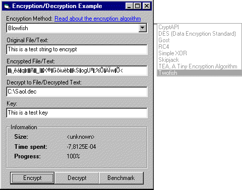



## SECURE encryption algorithms

### Description

This is a collection of SECURE encryption algorithms (BLOWFISH, TWOFISH, SKIPJACK, TEA, GOST, RC4 and DES). This post contains highly optimized code, if a similar post already exist here on PSC this one is at least a couple of 1000x faster!!

This is not like everybody else's "unbreakable" code, these are standardized encryption algorithms where the only possible way to crack it is by brute-force. DES is probably the least secure one (it took 22 hours for a supercomputer + 100,000 computers to crack it (distributed.net)). And that's the least secure one. ;)
 
### More Info
 

             |
---                |---
**Submitted On**   |2001-06-07 17:59:08
**By**             |[Fredrik Qvarfort](https://github.com/Planet-Source-Code/PSCIndex/blob/master/ByAuthor/fredrik-qvarfort.md)
**Level**          |Intermediate
**User Rating**    |4.9 (371 globes from 75 users)
**Compatibility**  |VB 4\.0 \(32\-bit\), VB 5\.0, VB 6\.0
**Category**       |[Encryption](https://github.com/Planet-Source-Code/PSCIndex/blob/master/ByCategory/encryption__1-48.md)
**World**          |[Visual Basic](https://github.com/Planet-Source-Code/PSCIndex/blob/master/ByWorld/visual-basic.md)
**Archive File**   |[SECURE enc20754672001\.zip](https://github.com/Planet-Source-Code/fredrik-qvarfort-secure-encryption-algorithms__1-12023/archive/master.zip)

